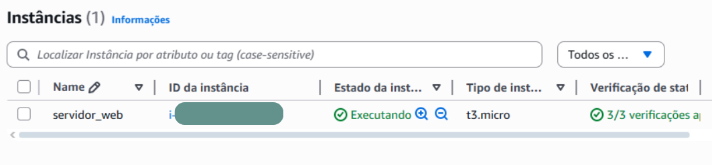
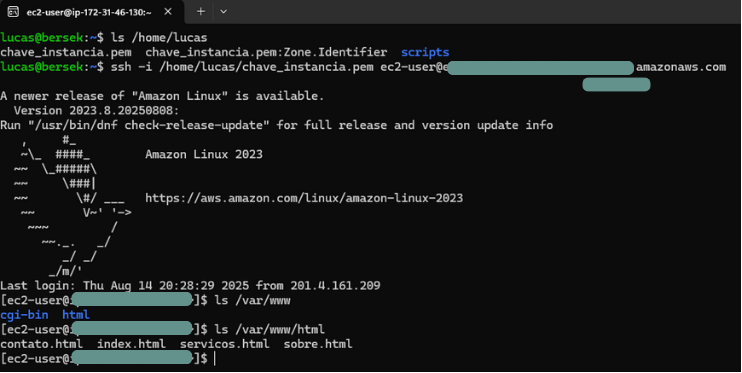
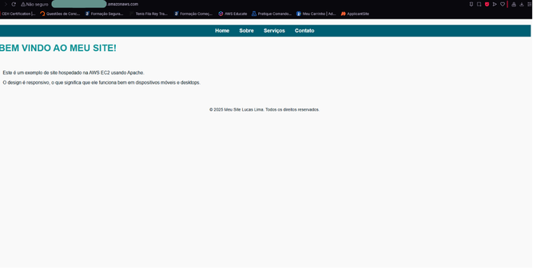

# 🚀 Meu primeiro servidor web na nuvem com AWS e Linux!

Este projeto consiste em realizar o deploy de um servidor web utilizando uma instância **EC2 na AWS** com AMI Linux, configurando acesso via **SSH** e instalando o **Apache** para hospedar uma página acessível pela internet.

---

## 💡 O que eu fiz neste projeto:
Durante o projeto, criei e gerenciei uma instância EC2 na AWS, configurei o acesso seguro usando chaves SSH e permissões no IAM, instalei e configurei o Apache em um sistema Linux e, por fim, disponibilizei um site simples para ser acessado diretamente pela nuvem. Foi muito satisfatório ver tudo funcionando na prática!

---

## 📸 Demonstração 

---

# 📚 Referências 

Esse projeto foi inspirado no curso da [Alura](https://lnkd.in/dJAqnQkY.) sobre **AWS Cloud**.
